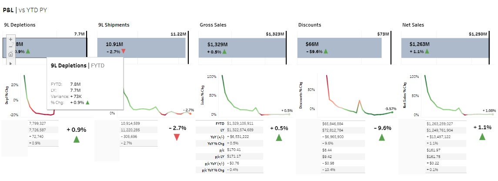
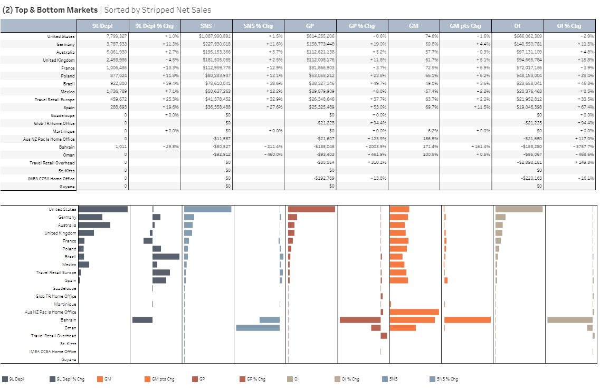

# Executive Dashboard | Financial Performance

## Project Overview:
This is a Tableau Dashboard that gives a high-level overview / executive summary of the P&L using the Depletion Adjusted Constant Currency (DACC) data. 

This repo houses Tableau Workbook files (.twbx) for a project that visualizes the Profit & Loss Statement accounts at a high level. The audience is primarily executive leadership, brand leadership, Finance Managers, or other analysts that need a high-level overview of the P&L with the ability to filter by time periods, Brands, and Markets.

## How to View the Project:
* The dashboard can be found on the TSP (Tableau Server) here: https://tsp.b-f.com/#/workbooks/1887?:origin=card_share_link.

## Additional Features:
* **Country / Market Hierarchy:** We will be adding a third hierarchy to the DACC data eventually. So this will give users the option to view the data in the dashboard by: (1) Beverages - Regions; (2) Global Travel Retail (GTR); or (3) Country/Market. The third option (Country/Market) is the hierarchy that is being added.
* **Additional Time Views**: Currently it is set for a FYTD view. We will add additional time periods (CYTD, 12-mo, 6-mo, 3-mo, 1-mo)
*  **US Breakdown by State**: Currently there is a top/bottom markets analysis at the country-level. We will add a US-specific view to allow for drill-down analysis at the state-level.

## Questions & Access:
* For questions, feedback, or access please contact Jenna Williams (jenna_williams@b-f.com), Lead Data Scientist | Global Advanced Analytics.
